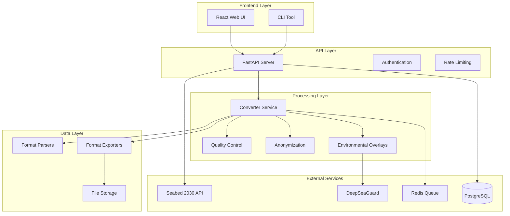

# Open Ocean Mapper Architecture

## Overview

The Open Ocean Mapper is designed as a modular, scalable system for processing ocean mapping data into Seabed 2030-compliant formats. The architecture follows microservices principles with clear separation of concerns.

## System Architecture



## Core Components

### 1. Frontend Layer

#### React Web UI (`frontend/`)
- **Technology**: React 18 + Vite + Tailwind CSS
- **Purpose**: User interface for data upload, job monitoring, and map visualization
- **Key Features**:
  - Drag-and-drop file upload
  - Real-time job status updates
  - Interactive map with Leaflet
  - Responsive design

#### CLI Tool (`cli/`)
- **Technology**: Python + Click
- **Purpose**: Command-line interface for batch processing and automation
- **Commands**:
  - `convert`: Data conversion
  - `qc`: Quality control
  - `upload`: Seabed 2030 upload preparation
  - `serve`: Start API server
  - `demo`: End-to-end demonstration

### 2. API Layer

#### FastAPI Server (`src/main.py`)
- **Technology**: FastAPI + Uvicorn
- **Purpose**: RESTful API for all operations
- **Endpoints**:
  - `POST /api/v1/ingest/upload`: File upload
  - `GET /api/v1/jobs/{job_id}`: Job status
  - `POST /api/v1/convert`: Start conversion
  - `GET /api/v1/status`: System health
  - `POST /api/v1/seabed2030/dry-run`: Upload preparation

### 3. Processing Layer

#### Converter Service (`src/pipeline/converter.py`)
- **Purpose**: Orchestrates the complete data processing pipeline
- **Pipeline Steps**:
  1. **Parse**: Extract data from input files
  2. **QC**: Apply quality control rules and ML anomaly detection
  3. **Anonymize**: Remove or hash sensitive information
  4. **Reproject**: Convert to standard coordinate systems
  5. **Surface**: Generate bathymetric surfaces
  6. **Overlay**: Apply environmental overlays
  7. **Export**: Write to output formats

#### Quality Control (`src/qc/`)
- **Deterministic Rules**: Range checks, consistency validation
- **ML Anomaly Detection**: ONNX model inference for anomaly detection
- **Quality Scoring**: Composite quality metrics

#### Anonymization (`src/pipeline/anonymize.py`)
- **Vessel ID Hashing**: Deterministic hashing of vessel identifiers
- **GPS Jittering**: Optional coordinate perturbation
- **Metadata Scrubbing**: Removal of sensitive metadata

### 4. Data Layer

#### Format Parsers (`src/pipeline/formats/`)
- **MBES**: Multi-beam echo sounder data
- **SBES**: Single-beam echo sounder data
- **LiDAR**: Light detection and ranging data
- **AUV**: Autonomous underwater vehicle telemetry
- **Single-beam**: Basic single-beam data

#### Format Exporters (`src/pipeline/exporters/`)
- **NetCDF**: CF-1.8 compliant NetCDF files
- **BAG**: Bathymetric Attributed Grid format
- **GeoTIFF**: Raster format with geospatial metadata

### 5. External Services

#### Seabed 2030 Integration (`src/adapters/seabed2030_adapter.py`)
- **Purpose**: Prepare data for global ocean mapping initiative
- **Features**:
  - Metadata validation
  - Format compliance checking
  - Dry-run upload simulation
  - Legal notice generation

#### DeepSeaGuard Integration (`src/pipeline/overlay.py`)
- **Purpose**: Environmental overlay plugin system
- **Features**:
  - Plume detection overlays
  - Environmental data integration
  - Plugin architecture for extensibility

## Data Flow

### 1. Upload Flow
```
User Upload → API Validation → File Storage → Job Queue → Processing
```

### 2. Processing Flow
```
Parse → QC → Anonymize → Reproject → Surface → Overlay → Export
```

### 3. Output Flow
```
Export → Storage → Notification → Download/Upload
```

## Technology Stack

### Backend
- **Python 3.11**: Core language
- **FastAPI**: Web framework
- **Pandas**: Data manipulation
- **NumPy**: Numerical computing
- **xarray**: NetCDF handling
- **rasterio**: GeoTIFF processing
- **pyproj**: Coordinate transformations
- **scipy**: Scientific computing

### Frontend
- **React 18**: UI framework
- **Vite**: Build tool
- **Tailwind CSS**: Styling
- **Leaflet**: Map visualization
- **Axios**: HTTP client

### Infrastructure
- **Docker**: Containerization
- **Redis**: Job queue and caching
- **PostgreSQL**: Metadata storage
- **Nginx**: Reverse proxy

## Security Considerations

### Data Privacy
- **Anonymization**: Deterministic hashing of sensitive data
- **Encryption**: Data encryption at rest and in transit
- **Access Control**: Role-based access control (RBAC)

### API Security
- **Authentication**: JWT tokens
- **Rate Limiting**: Request throttling
- **Input Validation**: Strict input validation
- **CORS**: Cross-origin resource sharing

## Scalability

### Horizontal Scaling
- **Stateless Services**: All services are stateless
- **Load Balancing**: Nginx load balancer
- **Container Orchestration**: Docker Compose/Kubernetes ready

### Performance Optimization
- **Async Processing**: Asynchronous job processing
- **Caching**: Redis-based caching
- **Database Indexing**: Optimized database queries
- **CDN**: Static asset delivery

## Monitoring and Observability

### Logging
- **Structured Logging**: JSON-formatted logs
- **Log Levels**: DEBUG, INFO, WARNING, ERROR
- **Centralized Logging**: Aggregated log collection

### Metrics
- **Prometheus**: Metrics collection
- **Grafana**: Metrics visualization
- **Health Checks**: Service health monitoring

### Tracing
- **Distributed Tracing**: Request tracing across services
- **Performance Monitoring**: Response time tracking

## Deployment

### Development
```bash
# Local development
python cli/open_ocean_mapper.py serve
npm run dev  # Frontend
```

### Production
```bash
# Docker Compose
docker-compose up -d

# Kubernetes
kubectl apply -f k8s/
```

## Configuration

### Environment Variables
- `SEABED2030_API_KEY`: Seabed 2030 API credentials
- `ANONYMIZATION_SALT`: Salt for anonymization
- `GPS_JITTER_RADIUS`: GPS jittering radius
- `MAX_CONCURRENT_JOBS`: Maximum concurrent jobs
- `MAX_FILE_SIZE_MB`: Maximum file size

### Configuration Files
- `config/config.yml`: Main configuration
- `config/config_template.yml`: Configuration template
- `.env`: Environment-specific settings

## Future Enhancements

### Planned Features
1. **Real-time Processing**: Stream processing capabilities
2. **Advanced ML**: More sophisticated anomaly detection
3. **Multi-format Support**: Additional input/output formats
4. **Cloud Integration**: AWS/Azure/GCP integration
5. **API Versioning**: Backward compatibility

### Performance Improvements
1. **GPU Acceleration**: CUDA support for ML models
2. **Distributed Processing**: Multi-node processing
3. **Caching Optimization**: Advanced caching strategies
4. **Database Optimization**: Query optimization

## Contributing

See [CONTRIBUTING.md](../CONTRIBUTING.md) for development guidelines and architecture decisions.
